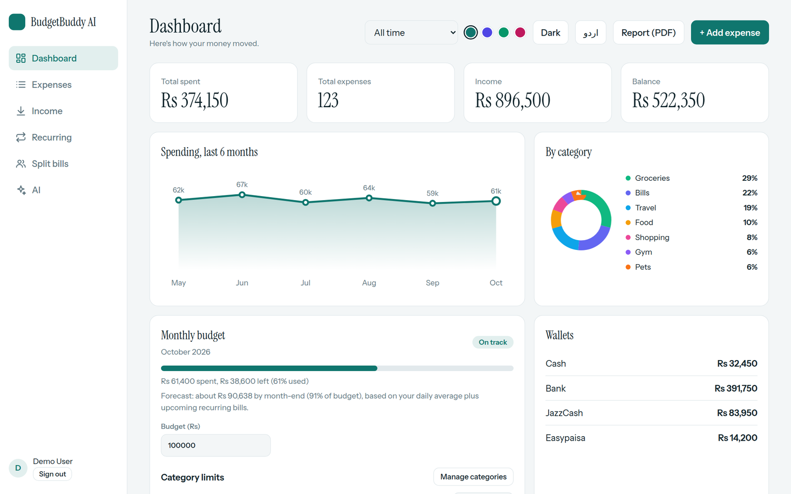
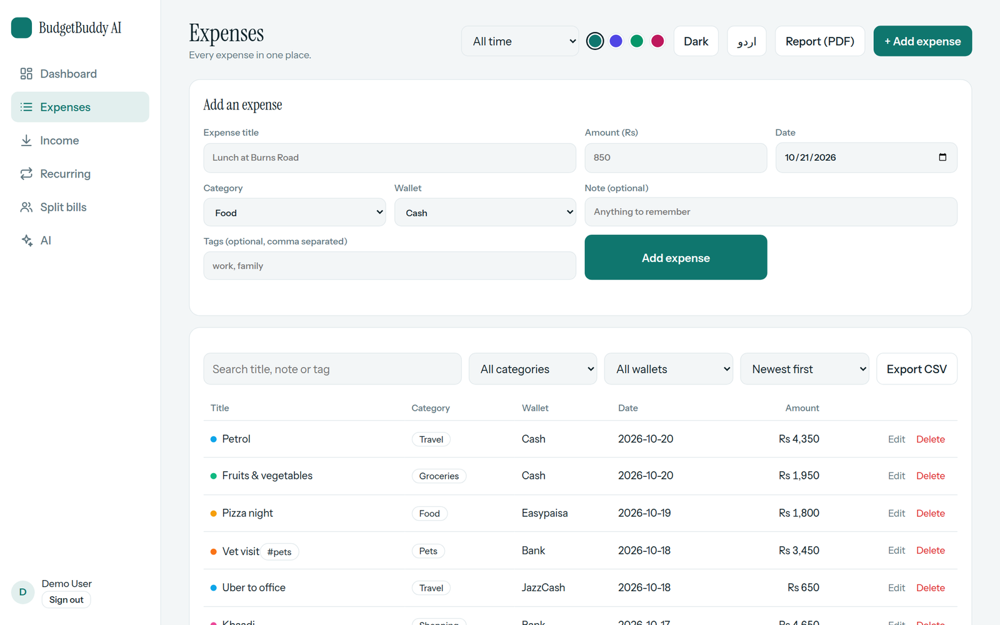
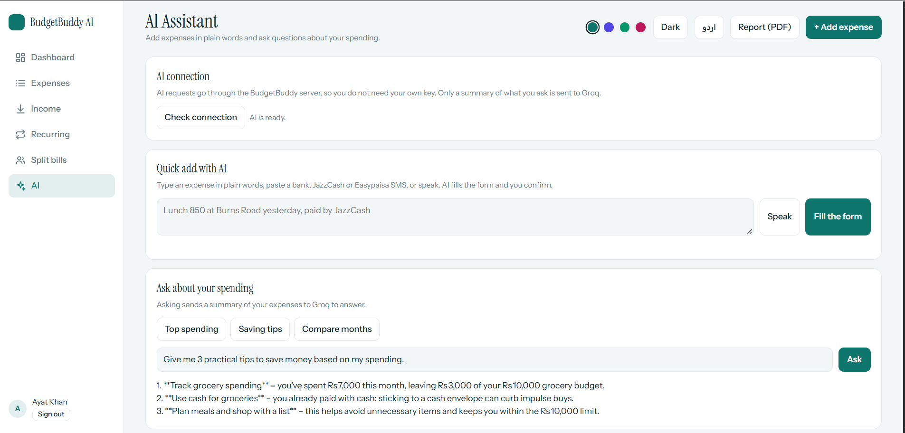
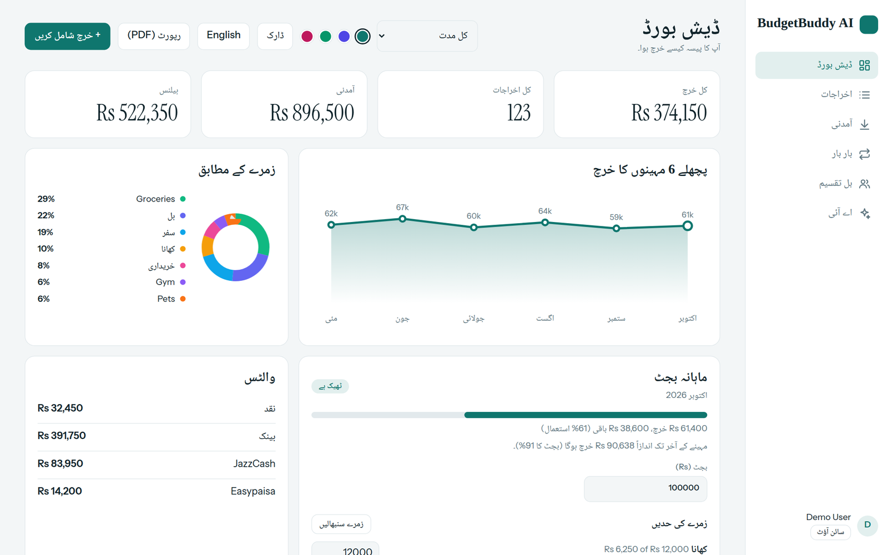
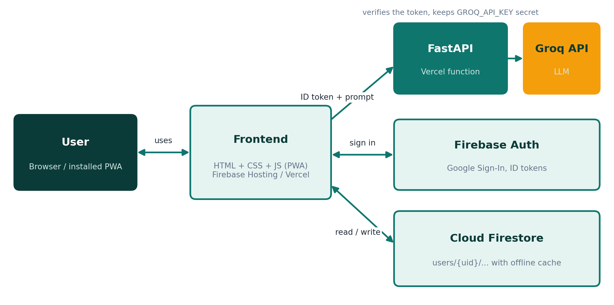
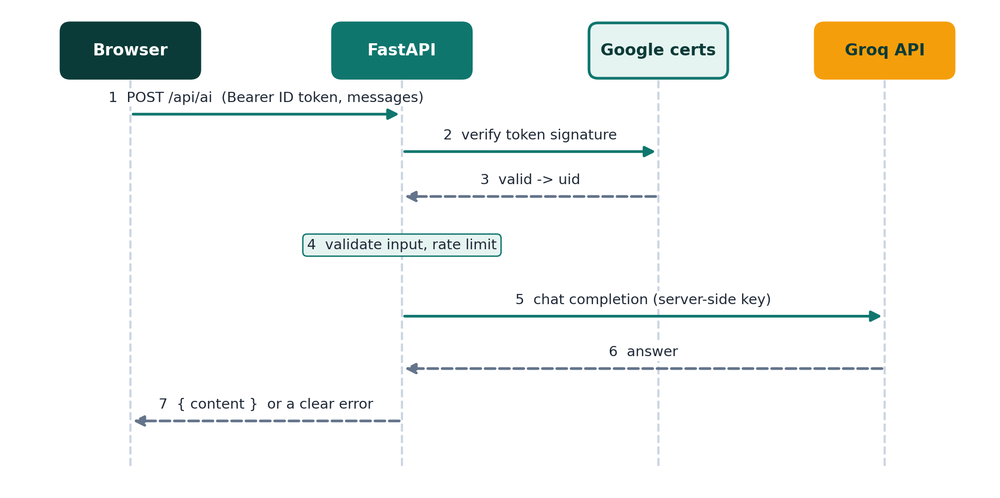
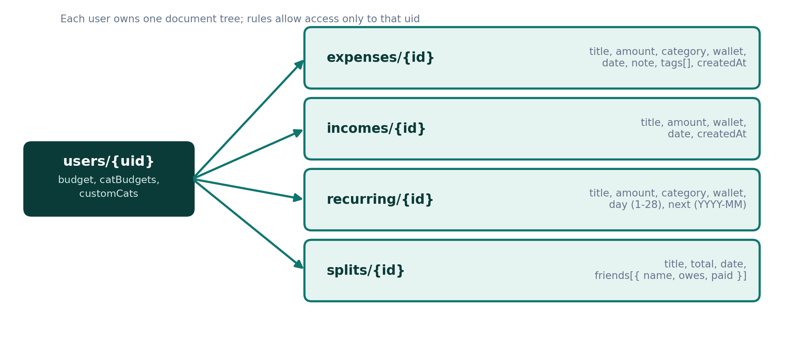

<div align="center">


# BudgetBuddy AI

**Track every rupee, ask your expenses questions in plain words, and stay inside your budget.**


[**Live Demo (Firebase)**](https://budgetbuddy-ai-23447.web.app) &nbsp;|&nbsp; [**Live Demo (Vercel)**](https://budgetbuddy-ai-xi.vercel.app) &nbsp;|&nbsp; [**Report a Bug**](https://github.com/scientistayat-engineer/BudgetBuddy-AI/issues)

</div>

---

## Table of Contents

- [About the Project](#about-the-project)
- [Screenshots](#screenshots)
- [Features](#features)
- [Custom Categories](#custom-categories)
- [Assignment Requirements](#assignment-requirements)
- [Architecture](#architecture)
- [Tech Stack](#tech-stack)
- [Folder Structure](#folder-structure)
- [Data Model](#data-model)
- [Backend API](#backend-api)
- [Getting Started (local)](#getting-started-local)
- [Deployment](#deployment)
- [Environment Variables](#environment-variables)
- [Testing](#testing)
- [Install as an App](#install-as-an-app)
- [Security](#security)
- [Known Limitations](#known-limitations)
- [Roadmap](#roadmap)
- [Documentation](#documentation)
- [License](#license)
- [Author](#author)

## About the Project

**BudgetBuddy AI** is a fast personal expense tracker. The frontend is plain HTML, CSS and JavaScript on top of **Firebase** (Google Sign-In and Cloud Firestore). The AI features (quick add, ask your spending, SMS parsing, monthly review) are powered by **Groq** and reach it through a small **FastAPI backend** that keeps the API key on the server.

It started as an "add, list and delete expenses" assignment and grew into a complete money-management app with budgets, charts, wallets, recurring bills, bill splitting and an English / Urdu interface.

Design goals:

- **Simple first.** The core flow (add an expense, see it in a table, see your totals) is always one click away.
- **Private by default.** Every user signs in with Google and can only read and write their own data.
- **No secrets in the browser.** The Groq key lives in a server environment variable; the API only answers signed-in users.
- **Works anywhere.** Responsive, installable and usable offline.
- **No build step.** No frontend framework or bundler.

## Screenshots

<!-- Add your screenshots to frontend/images/screenshots/ using these file names -->

| Dashboard | Expenses |
| :---: | :---: |
|  |  |

| AI Assistant | Urdu (RTL) |
| :---: | :---: |
|  |  |

## Features

**Core**
- Add an expense with title, amount, category (Food, Travel, Shopping, Bills, Other) and date
- **Custom categories:** create your own categories (name + colour) from the Category dropdown ("+ New category…") or from **Manage categories** on the dashboard. They are saved to your account, sync across devices and work everywhere: charts, category limits, filters, recurring bills, bill splitting, CSV/PDF reports and the AI features
- Expenses stored in **Cloud Firestore** and shown in a table directly below the form
- Delete (with one-tap **Undo**) and edit any expense
- Live totals: **total number of expenses** and **total amount spent**

**Dashboard and insights**
- KPI cards: total spent, total expenses, income and balance
- 6-month spending chart and category breakdown (donut)
- Monthly budget with status (On track / Almost there / Over budget) and category limits
- **Month-end forecast** from your daily average and upcoming recurring bills

**AI assistant (Groq through the FastAPI backend)**
- **Quick add:** type an expense in plain words ("Lunch 850 yesterday, paid by JazzCash"; English, Urdu or Roman Urdu) and the AI fills the form for you to confirm
- **Ask your expenses:** "Where did I spend the most this month?" answered from your own data
- **SMS paste:** paste a bank, JazzCash or Easypaisa SMS and the AI extracts amount, merchant and wallet
- **Voice input**, **auto-category** suggestion and an **AI monthly review**
- No personal API key needed: the server holds the key

**Money management**
- Income tracking and automatic balance, wallets (Cash, Bank, JazzCash, Easypaisa)
- Recurring expenses added automatically every month
- Split bills with friends and a tracker for who has paid you back

**Productivity and experience**
- Search, filter, sort, custom date ranges, notes and tags
- **Export CSV** and **Report (PDF)**
- Google Sign-In, installable PWA, offline-first with automatic sync
- Four colour themes plus dark mode, **English and Urdu** with right-to-left layout
- **Sample data** button for demos

## Custom Categories

Besides Food, Travel, Shopping, Bills and Other, every user can create their own categories.

**How to use**

1. Open the **Category** dropdown in the expense form (or in the recurring and split-bill dialogs) and choose **+ New category…**, or press **Manage categories** next to *Category limits* on the dashboard.
2. Type a name, pick a colour and press **Add category**. When you start from a form, the new category is selected for you.
3. Use it like any other category: it appears in the donut chart, category limits, the Expenses filter, CSV and PDF reports, and the AI quick add and auto-category suggestion.
4. To remove one, open **Manage categories** and press **Delete**. Expenses and recurring bills that used it are moved to **Other**, and its limit is removed (you are asked to confirm first).

**Rules**

- Name: 1 to 24 characters; must not repeat an existing name (case-insensitive) and must not contain any of the characters . / [ ] * ~ # $ or a backtick, and must not start with two underscores.
- At most 20 custom categories per user. The five built-in categories cannot be deleted, and **Other** always stays last in the list.
- Names are HTML-escaped wherever they are shown, and colours are validated, so a category cannot inject markup.

**Where it is stored:** `users/{uid}.customCats` in Firestore. It is read through the existing real-time listener, so a category created on one device appears on the others without a reload.

## Assignment Requirements

| Requirement | Status |
| --- | :---: |
| Create an AI Expense Tracker using Groq | Done |
| Simple UI with Title, Amount, Category (Food, Travel, Shopping, Bills, Other), Date and an Add Expense button | Done (plus your own custom categories) |
| Store all expense records in Firebase Firestore | Done |
| Display all saved expenses in a table below the form | Done |
| Delete button to remove an expense | Done |
| Show total number of expenses and total amount spent | Done |
| Deploy the application and share the live link | See [Deployment](#deployment) |

> Everything beyond this list (custom categories, budgets, charts, wallets, recurring bills, bill splitting, offline mode, Urdu, the Python backend) is extra.

## Architecture



1. The browser loads the static frontend (from Firebase Hosting or Vercel).
2. The user signs in with Google (Firebase Authentication); expenses are read and written directly in Cloud Firestore, protected by security rules.
3. For AI features the browser sends the user's **Firebase ID token** and the prompt to the FastAPI backend.
4. The backend verifies the token, validates and rate-limits the request, calls Groq with the server-side key and returns the answer.



## Tech Stack

| Layer | Technology |
| --- | --- |
| Frontend | HTML5, CSS3 (custom properties, grid, flexbox), vanilla JavaScript (ES modules), inline SVG charts |
| Backend | Python 3, **FastAPI**, Pydantic, httpx, google-auth (Firebase token verification) |
| AI | Groq API (OpenAI-compatible chat completions, default model `llama-3.3-70b-versatile`) |
| Authentication | Firebase Authentication (Google provider) |
| Database | Cloud Firestore with persistent offline cache |
| Offline and install | Service Worker and Web App Manifest (PWA) |
| Hosting | Firebase Hosting (frontend) and Vercel (frontend and Python serverless backend) |
| Testing | pytest with FastAPI TestClient and httpx MockTransport |

## Folder Structure

```
budgetbuddy-ai/
├── backend/
│   ├── __init__.py
│   └── main.py                 # FastAPI app: /api/health and /api/ai (Groq proxy)
├── frontend/
│   ├── index.html              # App markup: login, dashboard, pages, dialogs (incl. category manager)
│   ├── style.css               # Design system, themes, dark mode, RTL, print styles
│   ├── app.js                  # Auth, Firestore, rendering, custom categories, i18n, reports, AI client
│   ├── firebase-config.js      # Your Firebase web config
│   ├── api-config.js           # URL of the backend (API_BASE)
│   ├── sw.js                   # Service worker (offline app shell)
│   ├── manifest.webmanifest    # PWA manifest
│   └── images/
│       ├── icon.svg            # App icon
│       └── screenshots/        # Screenshots used in this README
├── api/
│   └── index.py                # Vercel entry point (re-exports backend.main:app)
├── docs/
│   ├── BudgetBuddy-AI-Report.docx
│   ├── BudgetBuddy-AI-Presentation.pptx
│   └── diagrams/               # Architecture, AI flow and data model diagrams
├── tests/
│   ├── test_api.py             # Backend tests (pytest)
│   └── frontend/
│       └── categories.test.js  # Custom-category tests (jsdom, Firebase mocked)
├── firebase.json               # Firebase Hosting (serves frontend/) and Firestore rules
├── firestore.rules             # Each user can access only their own data
├── .firebaserc                 # Default Firebase project ID
├── vercel.json                 # Vercel: serves frontend/, routes /api/* to FastAPI
├── requirements.txt            # Python dependencies (used by Vercel and locally)
├── requirements-dev.txt        # + pytest
├── .env.example                # Environment variables template
├── LICENSE
└── README.md
```

## Data Model



All data lives under the signed-in user's own document, so one user can never see another user's records.

Custom categories are stored on the user document itself (`customCats`, a list of `{ name, color }`), so the existing security rule already protects them and no rule change is needed. Each expense and recurring rule keeps its category as plain text, which means built-in and custom categories are handled the same way.

```
users/{uid}
├── budget            number           monthly budget
├── catBudgets        map              { Food: 8000, Travel: 3000, ... }
├── customCats        array            [{ name, color }] your own categories
├── expenses/{id}     title, amount, category, wallet, date (YYYY-MM-DD), note, tags[], createdAt
├── incomes/{id}      title, amount, wallet, date, createdAt
├── recurring/{id}    title, amount, category, wallet, day (1-28), next (YYYY-MM)
└── splits/{id}       title, total, date, friends[{ name, owes, paid }], createdAt
```

## Backend API

| Method | Path | Auth | Description |
| --- | --- | --- | --- |
| GET | `/api/health` | none | `{ status, ai_configured, auth_required, model }` |
| POST | `/api/ai` | Firebase ID token (`Authorization: Bearer ...`) | Chat completion through Groq |

`POST /api/ai` body:

```json
{
  "messages": [
    { "role": "system", "content": "You are a finance assistant." },
    { "role": "user", "content": "Where did I spend the most this month?" }
  ],
  "json_mode": false
}
```

Response: `{ "content": "..." }`. Errors come back as `{ "detail": "readable message" }` with status `401` (not signed in), `422` (invalid input), `429` (rate limit or Groq busy), `502` / `504` (Groq problem) or `503` (key not configured). Limits: 1 to 6 messages, 12,000 characters each, 30 requests per minute per user.

## Getting Started (local)

### Prerequisites

- Python 3.10+ and Node.js (only for the Firebase CLI)
- A Google account (Firebase), a free [Groq](https://console.groq.com) API key and a GitHub account

### 1. Get the code

```bash
git clone https://github.com/YOUR_USERNAME/budgetbuddy-ai.git
cd budgetbuddy-ai
```

### 2. Create the Firebase project

1. Open the [Firebase Console](https://console.firebase.google.com) and click **Add project**.
2. **Build > Authentication > Get started > Sign-in method > Google > Enable**, choose a support email, save.
3. **Build > Firestore Database > Create database** (production mode), open the **Rules** tab, paste [`firestore.rules`](firestore.rules) and **Publish**.
4. **Project settings > Your apps > Web app (`</>`)**: register an app and copy its config into `frontend/firebase-config.js`:

```js
export const firebaseConfig = {
  apiKey: "YOUR_API_KEY",
  authDomain: "YOUR_PROJECT_ID.firebaseapp.com",
  projectId: "YOUR_PROJECT_ID",
  storageBucket: "YOUR_PROJECT_ID.appspot.com",
  messagingSenderId: "YOUR_SENDER_ID",
  appId: "YOUR_APP_ID"
};
```

### 3. Run the backend and frontend together

```bash
python -m venv .venv
source .venv/bin/activate        # Windows: .venv\Scripts\activate
pip install -r requirements.txt
cp .env.example .env             # Windows: copy .env.example .env  (then fill in the values)
uvicorn backend.main:app --reload --env-file .env
```

Open http://localhost:8000. FastAPI serves the frontend and the API from the same address, so `API_BASE` in `frontend/api-config.js` stays empty. Check http://localhost:8000/api/health: `ai_configured` must be `true`.

## Deployment

Plan: put the **backend and frontend on Vercel** first, then optionally serve the same frontend from **Firebase Hosting** (it calls the Vercel backend).

### Step 1: Push to GitHub

```bash
git init
git add .
git commit -m "BudgetBuddy AI"
git branch -M main
git remote add origin https://github.com/YOUR_USERNAME/budgetbuddy-ai.git
git push -u origin main
```

(`.env` is git-ignored, so your keys are not uploaded.)

### Step 2: Deploy on Vercel (backend + frontend)

1. Sign in at [vercel.com](https://vercel.com) with GitHub and click **Add New > Project**, then import the repository.
2. Leave **Framework Preset** as *Other* and the root directory as the repository root. Do not set a build command (`vercel.json` already serves `frontend/` and routes `/api/*` to FastAPI).
3. Open **Environment Variables** and add `GROQ_API_KEY`, `FIREBASE_PROJECT_ID` and `ALLOWED_ORIGINS` (see [Environment Variables](#environment-variables)).
4. Click **Deploy**. Open `https://YOUR_APP.vercel.app/api/health` and confirm `"ai_configured": true`.
5. In the Firebase Console go to **Authentication > Settings > Authorized domains > Add domain** and add `YOUR_APP.vercel.app`, otherwise Google Sign-In is blocked on that domain.

After any change to environment variables, redeploy from the Vercel dashboard.

### Step 3: Deploy the frontend on Firebase Hosting

1. Open `frontend/api-config.js` and set `API_BASE` to your Vercel URL, for example `"https://YOUR_APP.vercel.app"`. Commit and push (Vercel redeploys itself).
2. Add your Firebase Hosting addresses to `ALLOWED_ORIGINS` in Vercel (`https://YOUR_PROJECT_ID.web.app,https://YOUR_PROJECT_ID.firebaseapp.com`) and redeploy.
3. Install the CLI and deploy:

```bash
npm install -g firebase-tools
firebase login
firebase use --add               # pick your project (or edit .firebaserc)
firebase deploy
```

4. Open `https://YOUR_PROJECT_ID.web.app`, sign in and try the **AI** page.
5. Put both live URLs at the top of this README and in the repository's **Website** field.

## Environment Variables

Set these in `.env` locally and in **Vercel > Project Settings > Environment Variables**.

| Name | Required | Description |
| --- | :---: | --- |
| `GROQ_API_KEY` | Yes | Your key from console.groq.com. Never commit it. |
| `FIREBASE_PROJECT_ID` | Yes (production) | Your Firebase project ID. When set, every `/api/ai` call must carry a valid Firebase ID token. |
| `ALLOWED_ORIGINS` | Yes (production) | Comma-separated sites allowed to call the API, no trailing slash, e.g. `https://YOUR_APP.vercel.app,https://YOUR_PROJECT_ID.web.app,https://YOUR_PROJECT_ID.firebaseapp.com` |
| `GROQ_MODEL` | No | Model name, default `llama-3.3-70b-versatile` (see console.groq.com/docs/models) |

## Testing

```bash
pip install -r requirements-dev.txt
python -m pytest -q
```

The 17 tests cover the health endpoint, request validation, Groq error mapping, JSON mode, Firebase token checks (valid, invalid, missing), rate limiting and CORS. No real network calls are made.

**Frontend (custom categories).** A small jsdom test loads the real `index.html` and `app.js` with Firebase replaced by an in-memory mock:

```bash
npm install --no-save jsdom
node tests/frontend/categories.test.js
```

Its 29 checks cover creating a category from the form, saving to `customCats`, validation (duplicates, built-in names, special characters, reserved words), HTML escaping, use in expenses, charts and limits, deleting a category that is in use, loading saved categories on start-up and the Urdu label.

## Install as an App

- **Android / Chrome:** open the site, tap the menu and choose **Install app**.
- **Desktop Chrome / Edge:** click the install icon in the address bar.

After the first visit the app shell is cached. Expenses added offline are saved on the device and sync to Firestore when you are back online.

## Security

- Authentication is handled by Firebase Authentication (Google). [`firestore.rules`](firestore.rules) let a signed-in user read and write only `users/{their own uid}`.
- The values in `frontend/firebase-config.js` are web identifiers, not secrets. Your data is protected by the rules and the authorized-domains list.
- The Groq key exists only as a server environment variable. The browser never sees it.
- The backend rejects calls without a valid Firebase ID token, validates every field, caps message count and size, and rate-limits per user.
- CORS only allows the origins listed in `ALLOWED_ORIGINS`.
- User text (including custom category names) is escaped before rendering, category names are validated (length, characters, duplicates, count) and AI output is validated before it is used.
- Asking a question sends a summary of that user's expenses (through your server) to Groq.

## Known Limitations

- The rate limiter keeps its counters in memory, so on serverless hosting each instance counts separately. It limits accidents, not a determined attacker.
- Recurring expenses are created when the app is opened, not by a background job.
- Voice input needs a browser with speech recognition (Chrome or Edge).
- Recurring rules cannot be edited yet; bill splitting is equal-share only.
- Custom categories cannot be renamed or re-coloured yet (delete and re-create instead); the AI picks from your category names as written.
- Urdu translations cover the interface; text you type is stored as written.

## Roadmap

- [x] Core expense tracking with Firestore
- [x] Budgets, charts, income, wallets, recurring expenses and bill splitting
- [x] Offline mode, installable app, English and Urdu
- [x] AI assistant powered by Groq
- [x] Python (FastAPI) backend so no API key is stored in the browser
- [x] Automated backend tests
- [x] Custom categories (create, colour, delete) with a frontend test
- [ ] Persistent rate limiting (Redis or Firestore)
- [ ] Daily reminder notifications
- [ ] Edit recurring rules and unequal bill splits
- [ ] Receipt photo attachments
- [ ] Rename and re-colour categories
- [ ] More frontend tests (the rest of the app)

## Documentation

- [Detailed report (Word)](docs/BudgetBuddy-AI-Report.docx)
- [Presentation (PowerPoint)](docs/BudgetBuddy-AI-Presentation.pptx)
- Diagrams in [`docs/diagrams`](docs/diagrams)

## License

Distributed under the **MIT License**. See [`LICENSE`](LICENSE).

## Author

**Anushay Ayat**, AI and Data Science student at SMIT

- GitHub: [@YOUR_USERNAME](https://github.com/YOUR_USERNAME)

## Acknowledgements

[Firebase](https://firebase.google.com), [Vercel](https://vercel.com), [FastAPI](https://fastapi.tiangolo.com), [Groq](https://groq.com), [Google Fonts](https://fonts.google.com) and [Shields.io](https://shields.io).

<div align="right">

[Back to top](#budgetbuddy-ai)

</div>
